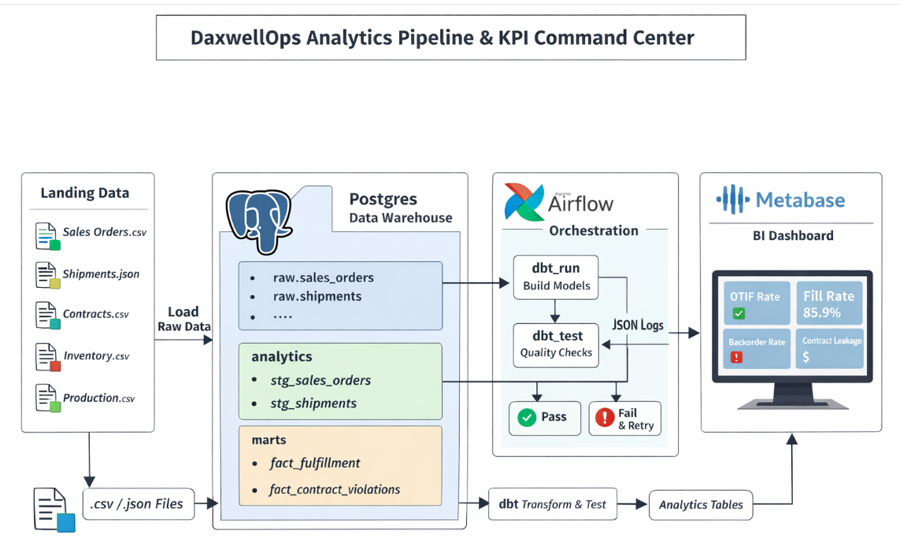
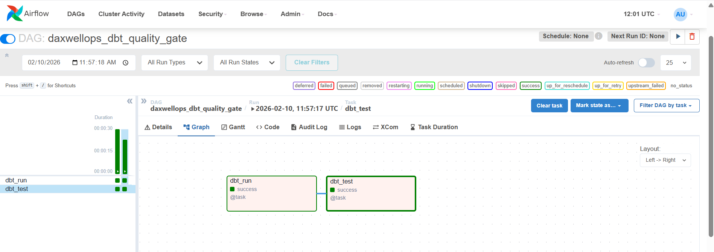
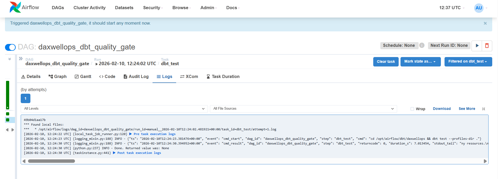
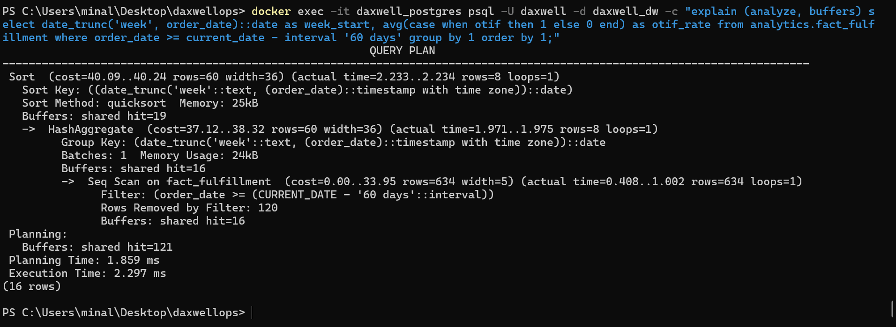

# DaxwellOps Analytics — Reliable Data Pipeline + KPI Dashboard  
*(Airflow • dbt • PostgreSQL • Metabase)*

A solo end-to-end analytics project that simulates a manufacturing/wholesale workflow (like Daxwell).  
It generates and ingests operational data, models it into trusted KPI tables, enforces data quality with automated tests, and publishes a stakeholder-ready dashboard.  
Pipeline reliability is demonstrated using **Apache Airflow** (quality gate + retries + structured JSON logs).

- **Repo:** https://github.com/Minalspawar/daxwellops-analytics  
- **Demo video (5–10 min):** `<ADD_LINK_HERE>`

---

## Why this project (Problem Statement)

Operations and Finance teams need reliable answers to:

- Are we shipping **On Time and In Full (OTIF)**?
- What is our **Fill Rate** and **Backorder Rate**?
- Are we violating **contract price / MOQ** rules (revenue leakage / compliance risk)?

Real-world data often has quality issues (missing IDs, duplicates, invalid quantities, price mismatches).  
This project builds a pipeline that produces consistent KPI definitions and **blocks bad data** from reaching dashboards.

---

## What you’ll see (Outcomes)

### KPI Marts (Postgres `analytics` schema)

- **`analytics.fact_fulfillment`**
  - OTIF flag
  - shipped vs ordered quantities
  - order-to-ship / ship-to-deliver lead times

- **`analytics.fact_contract_violations`**
  - contract checks (price mismatch, MOQ violations)
  - estimated revenue impact

### Reliability (Airflow Quality Gate)

DAG: **`daxwellops_dbt_quality_gate`**

- **`dbt_run`** → builds models  
- **`dbt_test`** → validates quality (pipeline fails if tests fail)
- Structured JSON logs per task: `cmd_start`, `cmd_result`, `duration_s`
- Failure injection + recovery demo included

---

## Architecture (High Level)

### Flow
1. Generate landing data (`data/landing/*.csv`, `shipments.json`)
2. Load into Postgres `raw.*` tables
3. dbt builds `analytics.stg_*` (staging) and `analytics.fact_*` (marts)
4. Airflow orchestrates and blocks bad data via `dbt test`
5. Metabase dashboard reads from `analytics.fact_*`

### Architecture Diagram

---

## Project Visuals


### Metabase Dashboard


### Airflow DAG (Quality Gate)


### Structured JSON Logs


---

## Tech Stack (What & Why)

- **Docker Desktop** — reproducible local environment
- **PostgreSQL** — analytics warehouse (`raw` + `analytics` schemas)
- **dbt-postgres** — modeling layers + automated tests (data quality)
- **Apache Airflow** — orchestration + retries + structured logs + quality gate
- **Python + Pandas** — synthetic data generation + loading (CSV + JSON)
- **Metabase** — stakeholder dashboards

---

## Dataset Used

Synthetic operational dataset generated locally to mirror manufacturing/wholesale activity:

- `sales_orders.csv` (orders, promised dates, pricing)
- `shipments.json` (semi-structured shipment events)
- `contracts.csv` (contract price, MOQ, effective dates)
- `inventory_snapshots.csv`
- `production_batches.csv`

- **Landing folder:** `data/landing/`  
- **Loaded to Postgres:** `raw.*` tables

---

## How to Run (Windows + PowerShell)

### 1) Start services
```powershell
docker compose up -d
docker ps
````

* Airflow UI: [http://localhost:8080](http://localhost:8080)  (admin / admin)
* Metabase: [http://localhost:3000](http://localhost:3000)
* Postgres (host): `localhost:5433` → container `5432`

### 2) Generate landing data

```powershell
pip install pandas
python .\scripts\generate_synthetic_data.py
```

### 3) Create schemas/tables

```powershell
Get-Content .\scripts\init_sql.sql | docker exec -i daxwell_postgres psql -U daxwell -d daxwell_dw
```

### 4) Load raw data

```powershell
pip install sqlalchemy psycopg2-binary
python .\scripts\load_raw_to_postgres.py
```

### 5) Build marts (dbt)

```powershell
docker exec -it daxwell_airflow bash -lc "cd /opt/airflow/dbt/daxwellops && dbt run --profiles-dir ."
```

### 6) Run tests (quality gate)

```powershell
docker exec -it daxwell_airflow bash -lc "cd /opt/airflow/dbt/daxwellops && dbt test --profiles-dir ."
```

---

## Metabase Setup (DB connection)

In Metabase → **Add database** → **PostgreSQL**:

* Host: `postgres`
* Port: `5432`
* Database: `daxwell_dw`
* Username: `daxwell`
* Password: `daxwellpass`

---

## Performance Optimization

This demo uses two practical optimization patterns:

1. **Precomputed marts**
   Metabase queries `analytics.fact_*` tables instead of raw multi-table joins.

2. **Indexes for scale**
   Indexes added on common filter/join columns (e.g., `order_date`, `customer_id`, `issue_type`).
   See: `scripts/performance_indexes.sql`

**EXPLAIN proof** (demo dataset is small, so Postgres may prefer Seq Scan):

* Weekly OTIF: Execution Time ≈ **2.936 ms**
* Weekly OTIF (last 60 days): Execution Time ≈ **2.297 ms**




---

## Failure Injection + Recovery (Quality Gate Proof)

Insert invalid data (negative qty) → `dbt_test` fails → fix record → pipeline recovers.

```powershell
docker exec -it daxwell_postgres psql -U daxwell -d daxwell_dw -c "insert into raw.sales_orders (order_id, order_date, customer_id, sku_id, qty_ordered, unit_price, promised_ship_date) values ('O_BAD_1','2026-02-01','C001','SKU001',-10,5.00,'2026-02-03');"
```

Fix:

```powershell
docker exec -it daxwell_postgres psql -U daxwell -d daxwell_dw -c "delete from raw.sales_orders where order_id='O_BAD_1';"
```

---

## Limitations

* Synthetic (simulated) data
* Batch processing only (no streaming)
* Local deployment (not EKS/EMR), but architecture is portable to cloud

---

## Future Scope

* Incremental loads + partitioning
* Alerts (Slack/Email/Discord) on failure
* Lineage docs (`dbt docs generate`)
* Streaming shipments (Kafka/Flink) and cloud deployment (EKS/EMR)

````

