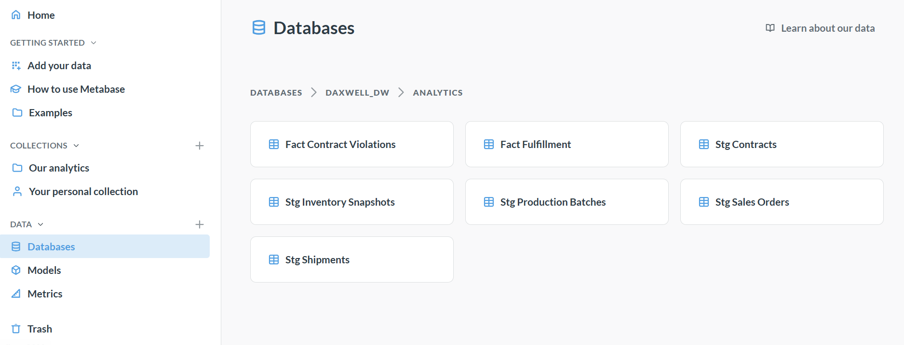

# DaxwellOps — Reliable Analytics Pipeline + KPI Command Center (Solo Project)

This project simulates a production-style analytics workflow for a manufacturing/wholesale business like **Daxwell**. It ingests operational data (orders, shipments, inventory, production, contracts), models it using **dbt**, validates it using **dbt tests**, orchestrates the workflow using **Apache Airflow** (quality gate + retries + structured JSON logs), and visualizes KPIs in **Metabase**.

**Demo Video (5–10 min):** <PASTE_VIDEO_LINK>  

---

## What Problem This Solves
Manufacturing/wholesale operations need reliable reporting for decisions across **finance, supply chain, and operations**. Typical business questions:
- Are orders shipped **On Time and In Full (OTIF)**?
- What is our **Fill Rate** and **Backorder Rate**?
- Are we complying with **contract pricing** and **MOQ** (minimum order quantity)?
- Where is there **revenue leakage** due to price mismatches?

This project builds a small analytics platform that turns raw operational data into **trusted KPIs** and enforces **data quality** automatically.

---

## Deliverables
✅ **Raw ingestion + analytics models**
- `raw.*` tables store ingested data
- `analytics.stg_*` staging views standardize raw data
- `analytics.fact_*` marts compute KPIs

✅ **KPI Marts**
- `analytics.fact_fulfillment` (OTIF, lead times, fill status)
- `analytics.fact_contract_violations` (contract validation + estimated revenue impact)

✅ **Reliability / Production Practices**
- Airflow DAG runs `dbt run` → `dbt test` (quality gate)
- If tests fail → pipeline fails (prevents bad data reaching dashboards)
- Structured JSON logs (`cmd_start`, `cmd_result`) with duration + output tails
- Retries + exponential backoff
- Failure injection + recovery demo

✅ **BI Dashboard**
- Metabase dashboard (“DaxwellOps KPI Command Center”)

---

## KPIs and Definitions
### OTIF (On Time In Full)
- **In Full** = `qty_shipped_total >= qty_ordered`
- **On Time** = `first_ship_date <= promised_ship_date`
- **OTIF** = In Full AND On Time

### Fill Rate
- **Fill Rate** = `Sum(qty_shipped_total) / Sum(qty_ordered)`
- Example run result: **85.94%**

### Backorder Rate
- Backorder = `qty_shipped_total < qty_ordered`
- Backorder rate = `% of orders backordered`

### Contract Leakage ($)
- Price mismatch when `invoiced_price != contract_price`
- Estimated impact: `(invoiced_price - contract_price) * qty_ordered`

---

## Architecture
**Flow**
1) Generate landing data (`data/landing/*.csv`, `shipments.json`)  
2) Load into Postgres `raw.*`  
3) dbt builds `analytics.stg_*` and `analytics.fact_*`  
4) Airflow orchestrates + blocks bad data via `dbt test`  
5) Metabase dashboard reads `analytics.fact_*`


---

## Tech Stack
- **Docker Desktop** (local runtime)
- **PostgreSQL** (warehouse)
- **Apache Airflow** (orchestration + reliability)
- **dbt-postgres** (modeling + tests)
- **Python + Pandas** (data generation + loading)
- **Metabase** (dashboards)

---

## Data Model
### Schemas
- `raw`: ingested tables
- `analytics`: staging + marts

### Raw tables (`raw.`)
- `raw.sales_orders`
- `raw.shipments` (semi-structured JSON ingested into structured table)
- `raw.contracts`
- `raw.inventory_snapshots`
- `raw.production_batches`

### Analytics models (`analytics.`)
**Staging views**
- `analytics.stg_sales_orders`
- `analytics.stg_shipments`
- `analytics.stg_contracts`
- `analytics.stg_inventory_snapshots`
- `analytics.stg_production_batches`

**Marts tables**
- `analytics.fact_fulfillment`
- `analytics.fact_contract_violations`

**[Screenshot Placeholder] Postgres Schemas/Tables**
- Add image: `docs/db_01_schemas_tables.png`
- 

---

## How to Run (Windows + PowerShell)

### Prerequisites
- Docker Desktop running
- Python 3.x installed

Verify:
```powershell
docker --version
docker compose version
python --version
````

### 1) Start services

From project root:

```powershell
docker compose up -d
docker ps
```

Services:

* Airflow UI: [http://localhost:8080](http://localhost:8080)
* Metabase: [http://localhost:3000](http://localhost:3000)
* Postgres mapped to host: `localhost:5433` (container port 5432)

### 2) Generate synthetic landing data

```powershell
pip install pandas
python .\scripts\generate_synthetic_data.py
dir .\data\landing
```

**[Screenshot Placeholder] Landing data files**

* Add image: `docs/run_01_landing_files.png`

### 3) Initialize Postgres schemas/tables

```powershell
Get-Content .\scripts\init_sql.sql | docker exec -i daxwell_postgres psql -U daxwell -d daxwell_dw
docker exec -it daxwell_postgres psql -U daxwell -d daxwell_dw -c "\dt raw.*"
```

**[Screenshot Placeholder] Raw tables**

* Add image: `docs/run_02_raw_tables.png`

### 4) Load raw data into Postgres

```powershell
pip install sqlalchemy psycopg2-binary
python .\scripts\load_raw_to_postgres.py
```

Verify counts:

```powershell
docker exec -it daxwell_postgres psql -U daxwell -d daxwell_dw -c "select 'sales_orders' tbl, count(*) from raw.sales_orders union all select 'contracts', count(*) from raw.contracts union all select 'shipments', count(*) from raw.shipments union all select 'inventory_snapshots', count(*) from raw.inventory_snapshots union all select 'production_batches', count(*) from raw.production_batches;"
```

**[Screenshot Placeholder] Raw counts**

* Add image: `docs/run_03_raw_counts.png`

### 5) Run dbt models

```powershell
docker exec -it daxwell_airflow bash -lc "cd /opt/airflow/dbt/daxwellops && dbt run --profiles-dir ."
docker exec -it daxwell_postgres psql -U daxwell -d daxwell_dw -c "\dt analytics.fact_*"
```

**[Screenshot Placeholder] dbt run success**

* Add image: `docs/dbt_01_run_success.png`

### 6) Run dbt tests (data quality)

```powershell
docker exec -it daxwell_airflow bash -lc "cd /opt/airflow/dbt/daxwellops && dbt test --profiles-dir ."
```

**[Screenshot Placeholder] dbt test pass**

* Add image: `docs/dbt_02_test_pass.png`

---

## Airflow Reliability (Quality Gate + JSON Logs)

### Airflow Login

* [http://localhost:8080](http://localhost:8080)
* Username: `admin`
* Password: `admin`

### DAG: `daxwellops_dbt_quality_gate`

Tasks:

1. `dbt_run` — builds models
2. `dbt_test` — quality gate (fails DAG if tests fail)

**[Screenshot Placeholder] DAG graph**

* Add image: `docs/airflow_01_dag_graph.png`

### Structured JSON Logs

Task logs include JSON events:

* `cmd_start` (step + command)
* `cmd_result` (returncode + duration + stdout_tail/stderr_tail)

**[Screenshot Placeholder] Structured JSON logs**

* Add image: `docs/airflow_02_structured_logs.png`

---

## Failure Injection + Recovery (Proof of Quality Gate)

### Inject bad data

```powershell
docker exec -it daxwell_postgres psql -U daxwell -d daxwell_dw -c "insert into raw.sales_orders (order_id, order_date, customer_id, sku_id, qty_ordered, unit_price, promised_ship_date) values ('O_BAD_1','2026-02-01','C001','SKU001',-10,5.00,'2026-02-03');"
```

Trigger DAG in Airflow → `dbt_test` should fail.

**[Screenshot Placeholder] DAG failed at dbt_test**

* Add image: `docs/airflow_03_fail_gate.png`

### Fix (delete bad record)

```powershell
docker exec -it daxwell_postgres psql -U daxwell -d daxwell_dw -c "delete from raw.sales_orders where order_id='O_BAD_1';"
```

Trigger DAG again → passes.

**[Screenshot Placeholder] DAG recovered**

* Add image: `docs/airflow_04_recovered.png`

---

## Metabase Dashboard

### Connect Metabase to Postgres (Docker network)

In Metabase ([http://localhost:3000](http://localhost:3000)):

* Host: `postgres`
* Port: `5432`
* DB: `daxwell_dw`
* Username: `daxwell`
* Password: `daxwellpass`

**[Screenshot Placeholder] Metabase connected**

* Add image: `docs/mb_01_connected.png`

### Dashboard: “DaxwellOps KPI Command Center”

Recommended tiles:

* OTIF Rate (Overall)
* OTIF Trend (Weekly)
* Fill Rate (Overall) — example: **85.94%**
* Backorder Rate (Overall)
* Contract Leakage ($) — Price mismatch only

**[Screenshot Placeholder]
 Full dashboard**


---

## Challenges Faced

* Postgres port conflict on 5432 (mapped host to 5433)
* PowerShell escaping for compose/env variables
* Airflow metadata initialization (`airflow db init`)
* dbt semicolon parsing errors in models (removed trailing `;`)
* Metabase formulas require display names (e.g., `Qty Shipped Total`)

---

## Limitations

* Synthetic data (simulated), not real Daxwell systems
* Batch pipeline only (no streaming)
* No RBAC governance included in this demo
* No incremental/CDC modeling (future enhancement)
* Local run only (not deployed on EKS/EMR)

---

## Future Scope

* Incremental loads + partitions + CDC
* Lineage docs (`dbt docs generate`)
* Alerting (Slack/Email/Discord) for failures
* Streaming shipments using Kafka/Flink
* Deploy on EKS; use EMR/Spark for scale

---

## How Stakeholders Use This

**Operations / Supply Chain:** OTIF trend, fill/backorder monitoring
**Finance / Sales Ops:** contract price mismatch detection + impact
**Data Analysts:** consistent KPI definitions + quality gates reduce analysis risk
**Leadership:** one dashboard for weekly reviews and decisions

---
